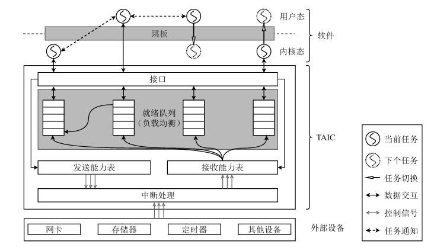
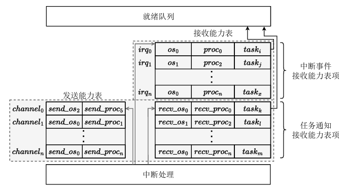

# 总体结构
新增TAIC，软件运行于CPU上，通过总线与TAIC交互。

# 硬件实现
TAIC由就绪队列、发送能力表、接收能力表和中断处理模块组成。

就绪队列：为每个CPU核心维护一个局部队列，通过窃取机制实现负载均衡。通过脉冲队列存储任务标识，在每个时钟周期根据优先级排序。提供入队和出队操作供软件调用。

发送能力表：记录可发送任务通知的发送方标识。

接收能力表：记录可接收中断事件和任务通知的接收方任务标识。针对每个外部中断信号只准备了一个表项。剩余一些用于接收通知的表项。

中断处理模块：根据接收能力表，查找需要唤醒的任务。如果切换前和切换后为同地址空间，通过用户态中断进行切换。其余情况均使用内核态中断进行切换。

# 软件实现
- 通过统一的跳板代码实现所有特权级，所有地址空间的任务切换。
- 在所有地址空间中添加TAIC的内存映射，供软件访问。

任务切换只需要跳转到跳板代码，由TAIC完成任务切换的具体操作。

通知操作首先需要发送和接收方向TAIC注册能力表项，然后通过send操作触发TAIC的任务切换。
