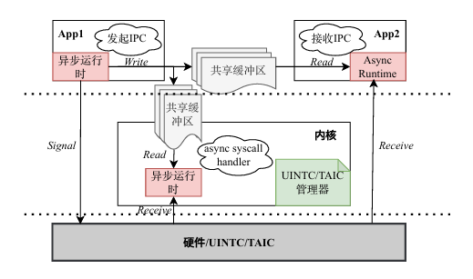
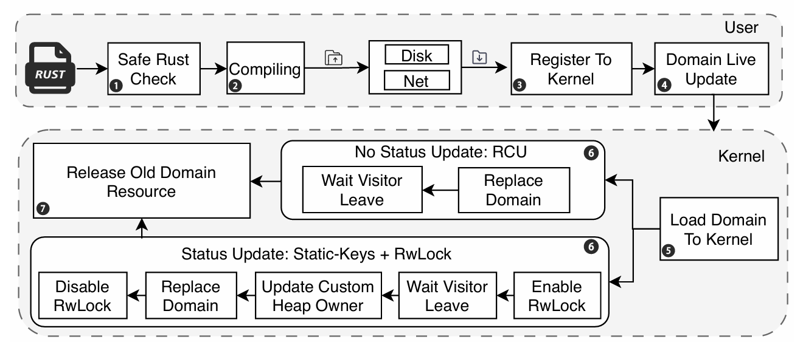

# ReL4

1. 异步通知（U-Notification）
- 陷入内核的主要开销来源于地址空间改变导致的TLB刷新。
- 接收方/发送方通过系统调用注册硬件资源，建立通知对象与硬件资源的映射。
- 通知时发送方触发用户态指令，无需陷入内核，仅注册时需要陷入内核。
- 低负载时使用中断方式，高负载时使用轮询方式，动态切换。

2. 异步系统调用
- 与异步通知不同，无法直接唤醒内核，通过专门的唤醒系统调用（WakeAsyncSyscallHandler）通知。
- 内核为CPU核心维持动态优先级，避免中断/异常被抢占，同时允许抢占低优先级任务。

3. 基于用户态中断的协程调度
- 协程分为worker和dispatcher两类：worker协程负责发起IPC请求，dispatcher协程处理响应消息，唤醒workder协程。
- 对于支持TAIC的平台，优先由TAIC直接唤醒workder协程，如果协程数量超过TAIC支持的中断数量（32-1=31），则通过唤醒dispatcher协程来间接唤醒worker协程。
- 通过多级优先级队列提升性能，UINTC平台使用的优先级位图数据结构，TAIC平台使用硬件实现

不禁想起我们之前os大赛整的“烂活”了，纯软件实现的同地址空间任务切换和任务调度既无法保证安全性又损失了性能。

# 基于软硬协同的任务调度和中断响应研究

1. 任务模型 \
使用𝑇(𝑃𝑖,𝐿𝑗,𝑆𝑘)来表示某个具体的任务实例
- 𝑃：表示执行流所处的地址空间以及占用的资源。
- 𝐿：表示执行流运行的特权级，可以是用户态、内核态或其他特权级；
- 𝑆：表示执行流的函数调用状态，可以是线程或协程的函数调用状态。

2. 任务切换
- 主动切换：任务因等待资源、发起系统调用或执行结束主动让权, 协程->协程/线程
- 被动切换：CPU收到中断或任务执行异常触发，线程->协程

- 同地址空间不跨特权级：用户态/内核态任务主动让权或同特权级中断/异常切换
- 同地址空间跨特权级：系统调用或中断/异常导致用户态到内核态切换
- 跨地址空间不跨特权级：内核态任务主动让权
- 跨地址空间跨特权级：使能KPTI时的系统调用或中断/异常切换

3. 硬件与软件协同
- 将任务的数字编号、优先级以及其他调度属性等信息组合成任务标识𝑇，再与任务所属的操作系统的标识𝑂和进程的标识𝑃组合，形成了分层复合型任务标识(𝑂(𝑊𝑖), 𝑃(𝑊𝑗), 𝑇(𝑊𝑘))，让硬件做出更准确的调度
- 硬件管理就绪态/运行态/阻塞态任务队列，软件管理创建和退出过程
- 软件写入等待中断的任务，硬件接收中断后唤醒任务，完成任务切换

# AlienOS技术报告

1. 域

2. 域的热更新
    
    1. 域的源代码会经过⼀个检查器，以确保其依赖中不包含含有unsafe代码的第三⽅库
    2. 域被rust编译器编译⽣成⼀个位置⽆关的可执⾏⽂件，我们可以将域放在磁盘当中，或者从⽹
    络上下载
    3. 域被注册到内核中，此时内核拥有了域⽂件，但没有被加载
    4. 管理者发起更新请求，内核开始处理域的更新
    5. 域被加载到内核地址空间中，此时内核拥有了域对象，同时域对象被域代理所包装
    6. 对不同的域，采取不同的同步措施
    1. 对于⽆状态域，使⽤RCU机制同步
    2. 对于有状态域，使⽤static-keys和读写锁进⾏同步
    7. 当旧的域被替换后，其所分配的资源被回收